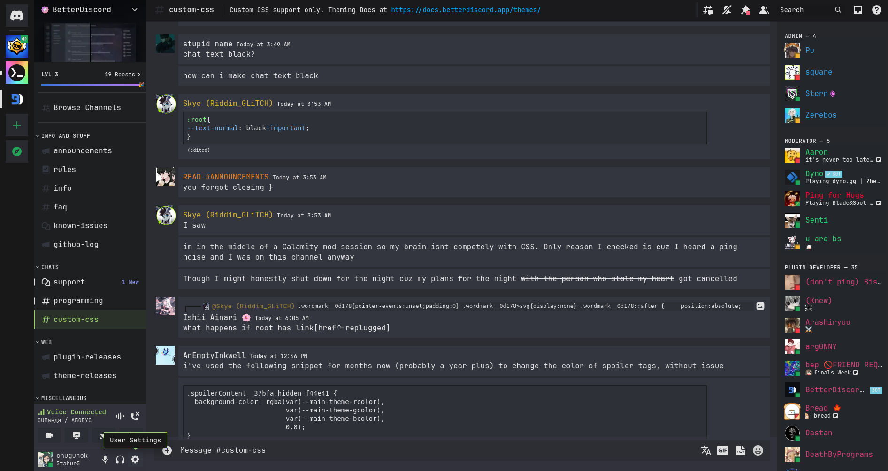
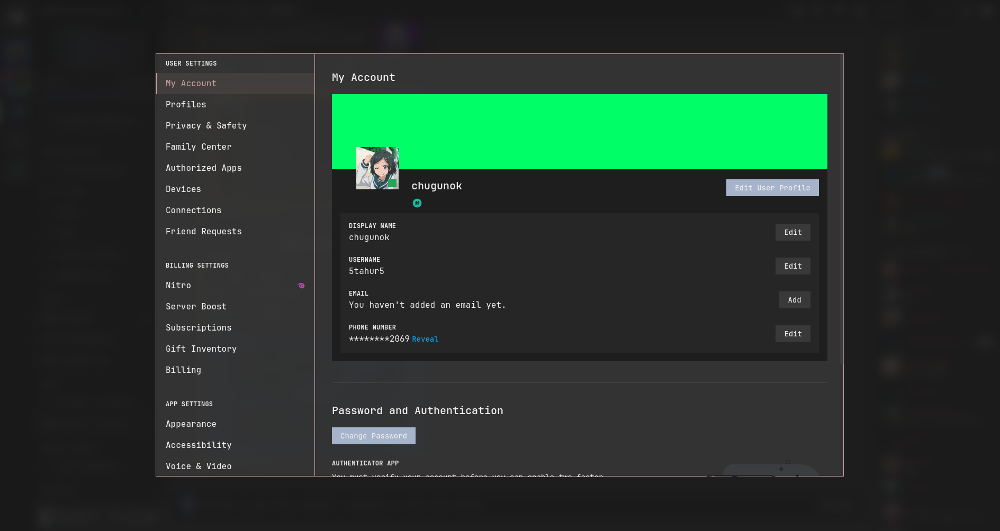
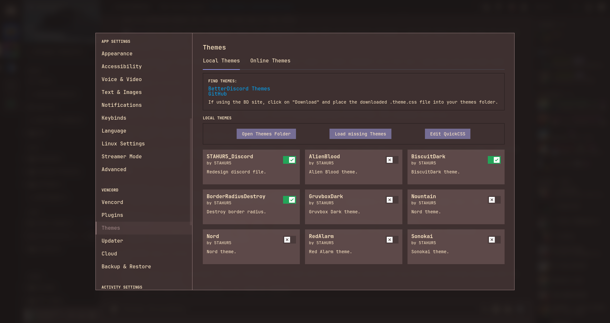
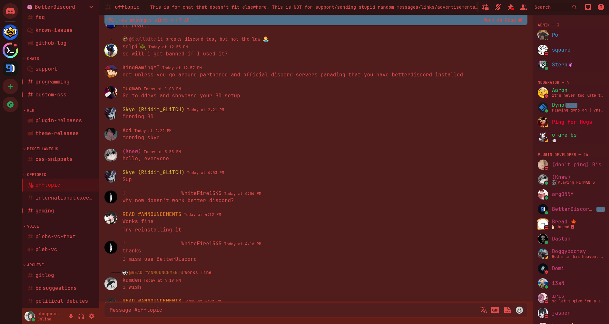
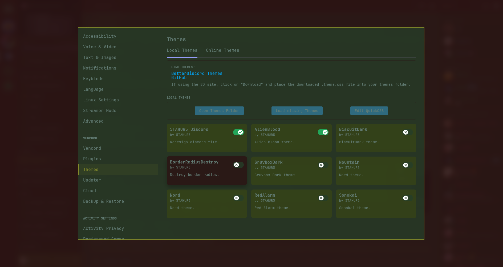
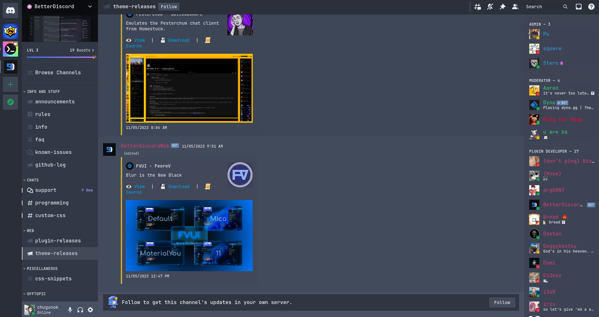

# Discord themes for Vencord (and BetterDiscord, but i not know how it use themes)
This repository contains the following themes
- [Nord]
- [Alien Blood]
- [Mountain]
- Red Alarm
- [Biscuit Dark]
- [Gruvbox Dark]
- [Sonokai]
- And file, that removes rounding

## Installing for Vencord
```bash
git clone https://github.com/5TAHUR5/discord_themes.git
cd ~/discord_themes
cp RoundingDestroy.theme.css Sonokai.theme.css AlienBlood.theme.css BiscuitDark.theme.css GruvboxDark.theme.css Mountain.theme.css Nord.theme.css RedAlarm.theme.css ~/.config/Vencord/themes
rm -r ~/discord_themes
```

## Screenshots








   [Nord]: <https://www.nordtheme.com/>
   [Alien Blood]: <https://github.com/thomasabishop/alien-blood-vscode/>
   [Mountain]: <https://github.com/mountain-theme/Mountain/>
   [Biscuit Dark]: <https://github.com/Biscuit-Colorscheme/biscuit/>
   [Gruvbox Dark]: <https://github.com/morhetz/gruvbox/>
   [Sonokai]: <https://github.com/sainnhe/sonokai/>
