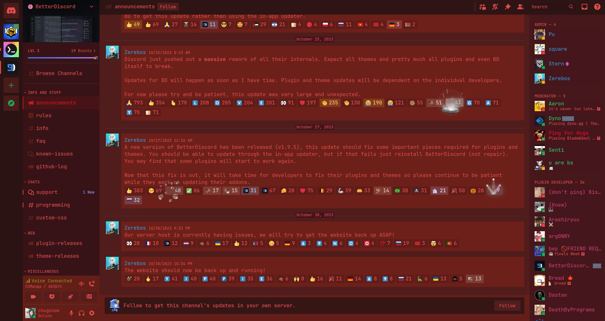
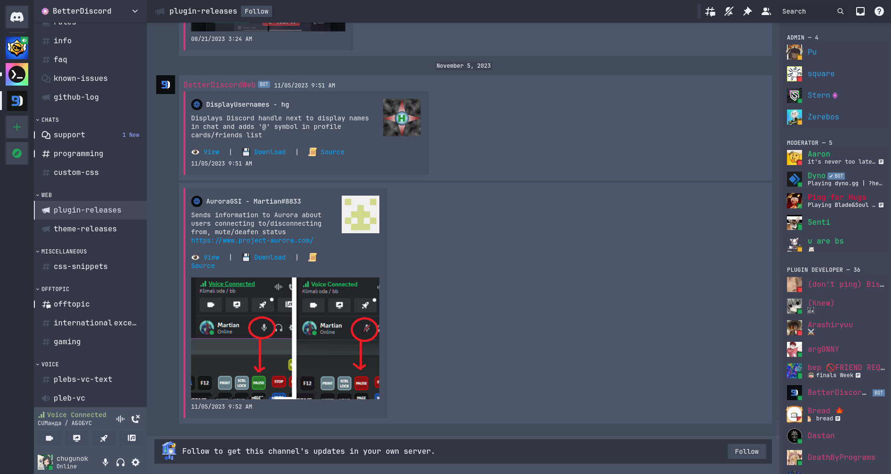

# Discord themes for Vencord (and BetterDiscord, but i not know how it use themes)
This repository contains the following themes
- [Nord]
- [Alien Blood]
- [Mountain]
- Red Alarm
- [Biscuit Dark]
- [Gruvbox Dark]
- [Sonokai]
- [Catppuccin]
- [Edge]
- [Everforest]
- [Everforest soft]
- [Stardew]
- And file, that removes rounding

## Installing for Vencord
```bash
git clone https://github.com/5TAHUR5/discord_themes.git
cp -r ~/discord_themes/themes/ ~/.config/Vencord/
rm -r ~/discord_themes
```

## Screenshots







   [Nord]: <https://www.nordtheme.com/>
   [Alien Blood]: <https://github.com/thomasabishop/alien-blood-vscode/>
   [Mountain]: <https://github.com/mountain-theme/Mountain/>
   [Biscuit Dark]: <https://github.com/Biscuit-Colorscheme/biscuit/>
   [Gruvbox Dark]: <https://github.com/morhetz/gruvbox/>
   [Sonokai]: <https://github.com/sainnhe/sonokai/>
   [Catppuccin]: <https://github.com/catppuccin/catppuccin/>
   [Edge]: <https://github.com/sainnhe/edge/>
   [Everforest]: <https://github.com/sainnhe/everforest/>
   [Everforest soft]: <https://github.com/sainnhe/everforest/>
   [Stardew]: <https://github.com/TorchedSammy/dotfiles/blob/master/.config/awesome/themes/colors/stardew.lua/>
